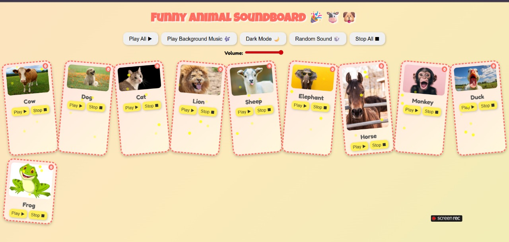

# Funny Animal Soundboard for Kids 🎉🐮🐶

A fun, interactive, and colorful animal soundboard for kids!  
Click on the animals to play their sounds, learn fun facts, or use keyboard shortcuts (1-0) to play them quickly.

## Features

- 🎵 Play individual animal sounds
- 🎶 Play/Pause background music
- 🌙 Dark mode toggle for night time
- 🎲 Random sound button
- ⏹ Stop all sounds
- 🔊 Volume control
- ⭐ Animated stars and floating bubbles
- 🐾 Click an animal to hear a fun fact about it
- Keyboard shortcuts: 1-0 for each animal

## Demo

  
[Watch Demo Video](demo.mp4)


## Installation / Usage

1. Clone the repository:

```bash
git clone https://github.com/yourusername/funny-animal-soundboard.git
Open index.html in your browser.

Make sure you have all the audio and image files in the same folder:

cow.mp3, dog.mp3, cat.mp3, lion.mp3, sheep.mp3, elephant.mp3, horse.mp3, monkey.mp3, duck.mp3, frog.mp3

cow.webp, dog.jpg, cat.avif, lion.jpg, goat.jpg, elephant.jpg, horse.jpeg, monkey.jpg, duck.jpg, frog.jpg

background.mp3

Click animals or use the buttons to play sounds and enjoy!

How it works
Uses HTML, CSS, and JavaScript.

Each animal has a play/stop button and a fun fact read using SpeechSynthesis.

Animations, gradient background, and floating stars make it visually attractive for kids.